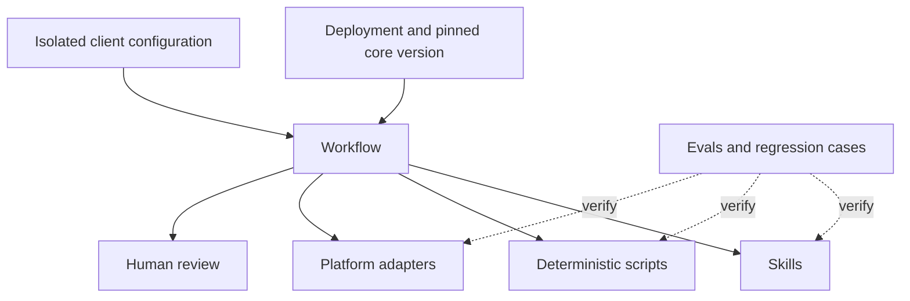

# Core Skills Library

An architecture for reusable agent instructions and tools that keeps client configuration separate from general operating logic.

**Agent architecture · AI enablement · Evaluation and handoff**<br>
**Status:** private v0.1.0 architecture foundation, with a separate runnable public example.

[Architecture](docs/architecture.md) · [Approval-gate example](examples/approval_gate.py) · [Regression tests](tests/test_approval_gate.py) · [CI checks](https://github.com/saraaward/core-skills-showcase/actions) · [Sara Ward](https://saraward.ai)

## The Problem

Agent workflows become difficult to maintain when general instructions, platform mechanics, client rules, and one-off fixes accumulate in the same prompt. A change for one deployment can affect unrelated work, and it becomes unclear which version is running.

## What I Built

The private foundation defines the repository architecture, an authoring-standard skill, templates, versioning guidance, and shared discovery paths for Claude Code and Codex. One canonical skills directory supports both tools.

| Layer | Responsibility |
| --- | --- |
| Skills | Reusable judgment, standards, and decision methods |
| Scripts | Deterministic mechanical operations |
| Workflows | Coordination and review routing |
| Adapters | Platform-specific integration behavior |
| Client configuration | Isolated terminology, policies, credentials, and operating context |
| Evals | Expected decisions, failure cases, and regression protection |

Adapter, workflow, script, and eval directories establish the intended structure. A complete production adapter collection and executable library-wide regression harness remain future work for this foundation.

## Workflow

The architecture defines: deployment input and isolated configuration → workflow coordination → skills, scripts, and adapters → checks and human review → documented handoff.

The runnable public example demonstrates a narrower boundary: artifact revision and check results → deterministic validation → evaluation status → human approval of the same revision → readiness decision.

## My Role

System owner and principal designer of the architecture, authoring standards, ownership boundaries, and versioning approach. The public example illustrates one of those boundaries; it is not an export of the private library.

## Technology

**Markdown skill definitions · Git and versioned releases · Claude Code / Codex discovery paths**<br>
**Public example:** Python 3.9+, standard library `dataclasses` and `unittest`; GitHub Actions.

## AI vs Deterministic Logic

Skills define judgment and decision methods for agents. Scripts own mechanical checks; adapters own platform behavior; client configuration supplies deployment-specific rules. The Python example calls no model: it evaluates required checks, revision identity, and approval state using conventional code.

## QA & Human Oversight

The public example requires actual boolean passes, rejects stale evaluation and approval, and keeps ambiguous evaluation in human review. It returns a decision and reason without delivering an artifact.

```bash
python3 examples/approval_gate.py
python3 -m unittest discover -s tests -v
```

**Verification:** all 10 regression tests passed locally on September 15, 2026; the repository also runs the example and tests in GitHub Actions. Inputs are synthetic and the example makes no network calls.

The example does not authenticate reviewers, persist records, validate content hashes, or perform delivery. Its revision and approval inputs must come from trusted application state in a real implementation. See [architecture and limitations](docs/architecture.md).

## Architecture



This diagram describes the architecture; it does not imply every layer has a production implementation.

## Outcome

The foundation gives reusable knowledge, execution mechanics, and client context explicit homes. The public reference example makes one approval boundary executable and reviewable. Its passing tests do not establish production readiness of the entire library.

## What I Learned

A correction belongs in the layer that owns the failure. Reviewed failures should become eval cases, followed by a targeted change, regression check, and versioned release. Deployments need a pinned revision and their own configuration to make that process traceable.

## Confidentiality

This public case study describes the system architecture and workflow while omitting proprietary source code, credentials, customer data, and internal infrastructure. The runnable example is standalone and synthetic.
