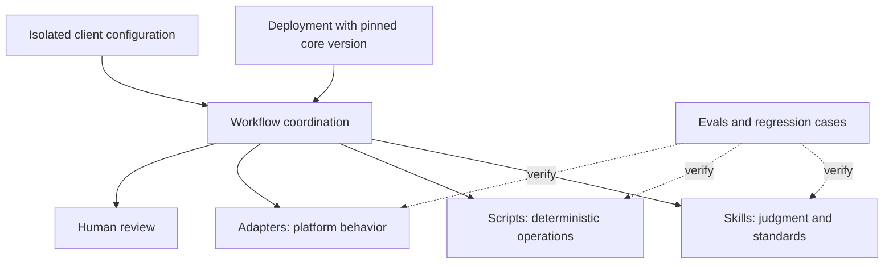

# Architecture and boundaries

[Back to project](../README.md)

## Change the layer that owns the problem

| Failure | Appropriate home for the fix |
| --- | --- |
| A general decision rule is unclear | Skill |
| A repeatable transformation is incorrect | Script |
| A platform's API behavior changes | Adapter |
| One client has a different approval policy | Client configuration |
| Work reaches the wrong reviewer | Workflow |
| A known failure returns unnoticed | Eval |

## Discovery and versions

The private foundation uses one canonical `skills/` directory. Claude Code and Codex discover it through relative links, so the integration paths do not maintain competing copies. Individual skill versions and repository revisions serve different purposes: a skill's version tracks its behavior, while a pinned repository revision identifies the exact component set a deployment consumes.

## Example boundary

The public approval gate compares an artifact revision with the revisions attached to evaluation and approval. A new revision invalidates an earlier review. Required checks must be actual boolean `True` values; a string such as `"true"` is insufficient.

The example returns `blocked`, `needs_human_review`, or `ready`. It does not authenticate reviewers, validate a content hash, persist state, invoke a model, or deliver an artifact. In a real service, revision identifiers and approval records must come from trusted, authenticated storage rather than caller-supplied values.

## Status

The architecture and authoring foundation exist in the private library. The public example has its own executable regression tests. These are distinct pieces of evidence; the example does not establish production readiness of the whole library.
